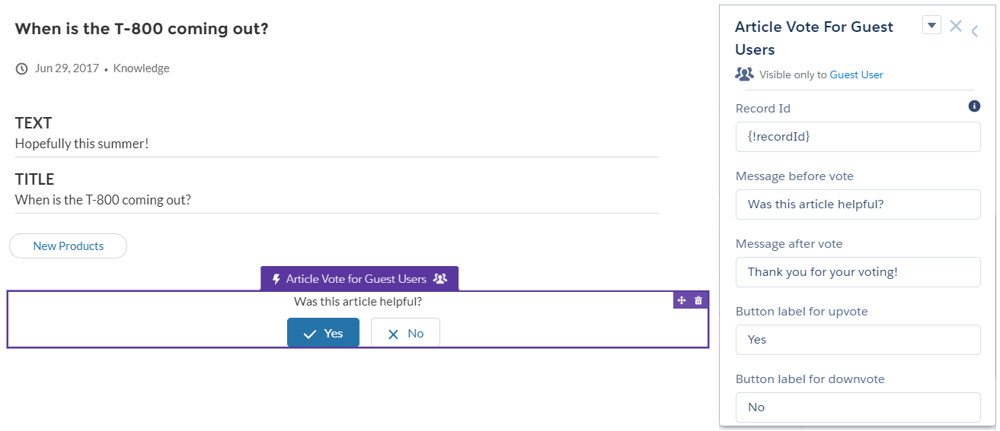
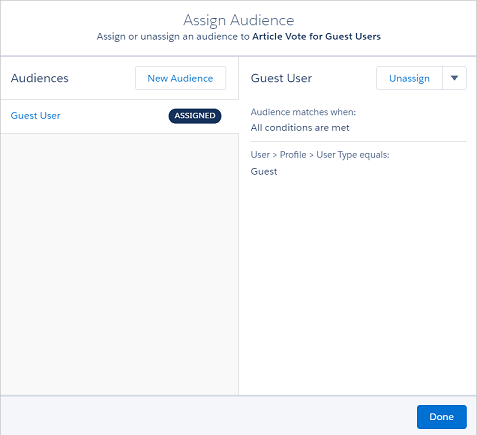

# Community Cloud のゲストユーザ向け記事の投票

 

コミュニティで公開されたナレッジ記事をゲストユーザが投票できるようにするコンポーネントです。投票結果はカスタムオブジェクト内で確認できます。

[English](README.md) | [日本語](README.ja.md)

## 前提条件

-   Lightning Knowledge が有効化されている
-   記事の言語が単一

## 使用方法

1. パッケージをインストールする ([本番環境/DE](https://login.salesforce.com/packaging/installPackage.apexp?p0=04tf40000047tgtAAA) | [Sandbox](https://test.salesforce.com/packaging/installPackage.apexp?p0=04tf40000047tgtAAA)) か、このリポジトリをクローンして、ソースコードを組織にデプロイします。

2. コミュニティビルダーの記事詳細ページに `Article Vote for Guest Users` コンポーネントを配置します。

3. コンポーネント設定の Record Id の欄に `{!recordId}` と入力します。

4. 必要に応じて、コンポーネント設定で、メッセージやボタンの表示ラベルを変更します。

5. 既にコミュニティでログインユーザ向けに記事の投票を許可している場合は、このコンポーネントがゲストユーザにだけ表示されるように[利用者設定](https://help.salesforce.com/articleView?id=networks_audience_component.htm&type=0&language=ja)を変更することをお勧めします。

6. コミュニティのゲストユーザプロファイルで `GuestArticleVoteController` Apex クラスのアクセスを許可します。

## 投票結果

投票結果は `GuestArticleVote__c` というカスタムオブジェクトに保存されます。このカスタムオブジェクトには以下の項目が含まれます。このカスタムオブジェクトに対してレポートを作成することで、ナレッジの改善に役立てることができます。

-   **Knowledge** : 記事へのルックアップ項目 (注: この項目を主従関係にする場合は、共有設定オプションを参照のみとしてください。)
-   **Guest User Id** : ゲストユーザ ID (この値は訪問者の Cookie に紐づきます)
-   **Upvoted?** : True の場合 Upvote を意味します

## フィードバック

機能のリクエストや不具合のご連絡は Issue でお知らせください。

## ライセンス

[MIT license](./LICENSE) です。
